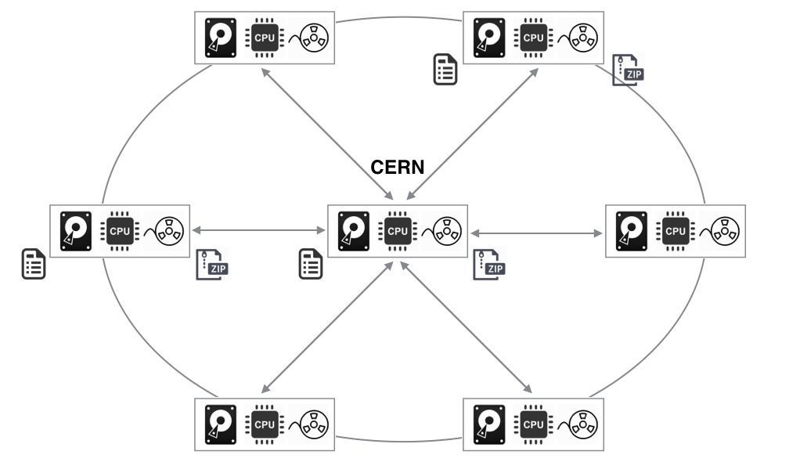

# DataPopularity

## Introduction
The LHCb collaboration is one of the four major experiments at the Large Hadron Collider at CERN. The detector, as well as the Monte Carlo simulations of physics events, create PBs of data every year. The data needs to be distributed to multiple locations to be available for thousands researchers around the world. For this the LHCb data grid is used. 

The LHCb data grid has a Tier-1 center at CERN and six aditional regional Tier-1 and 14 Tier-2 centers around the world. The Tier-1s are the most important because they are responsible for all the production-processing phases associated with the real data. The Tier-1s are used for generating RAW data, reconstruction, stripping and user analysis. The center at CERN is also used for generating RAW data. The Tier-2s are used for Monte-Carlo production which is then uploaded to the Tier-1s.

Each Tier-1 has CPUs, disk and tape storages. The tapes are used for archiving the data. The disks keep data which is currently used in user analysis. To meet the needs for scalability, fast access and user collaboration, each dataset has several replicas distributed over the Tier-1s. This provides faster access to datasets for users and the preservation of a network bandwidth because replicas can be placed close to centers where users need them. But creation of replicas is bound by the availability of storage within centers.

In this study we determine for which datasets number of replicas can be decreased or increased, which datasets likely will not be used in ruture and can be removed from disks.

## Method description
